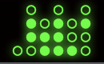
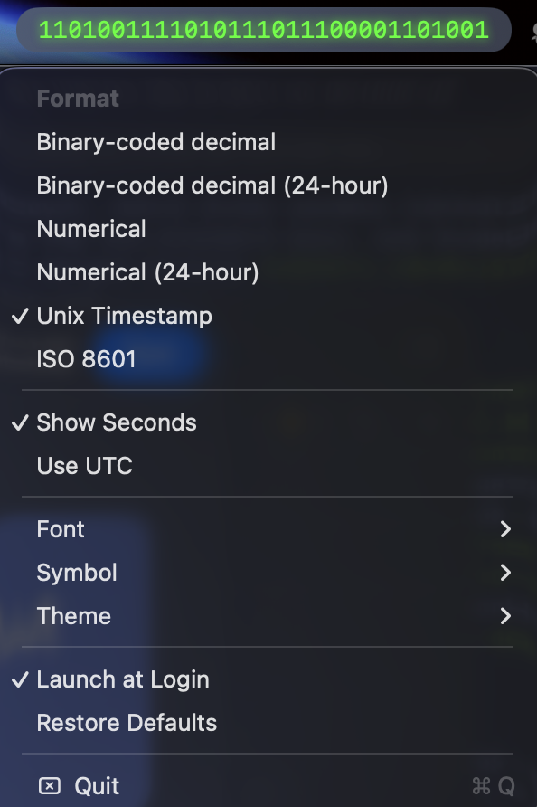

# BitTime

A menu-bar clock for macOS that displays the time in unconventional formats:
binary-coded decimal (BCD), Unix epoch, ISO 8601, and more.

This is the open-source distribution of the macOS app. Get the official app on the App Store [here](https://apps.apple.com/us/app/bittime-binary-clock/id6749833995). The iPadOS/iOS/watchOS app is [here](https://apps.apple.com/us/app/bittime-binary-clock/id6749833995). Note that the mobile app code is not included in this repo.





## Features

- Lives in the menu bar
- Multiple display formats: 12-hour, 24-hour, Unix, ISO 8601, BCD circles, BCD rectangles.
- macOS Widgets (small/medium/large) for every format.
- Spotlight integration (`bittime://` URL scheme).
- Configurable themes, fonts, glow effects, and custom colors.
- Optional launch at login.

## Requirements

- macOS 13.5 or later (widgets require macOS 14.0).
- Apple Silicon or Intel.

## Install

### Pre-built release

Download the latest `BitTime.zip` from the
[Releases page](https://github.com/clete2/BitTime/releases),
unzip, and drag `BitTime.app` to `/Applications`.

The release build is **ad-hoc signed** (not notarized). The first time you launch
it, macOS Gatekeeper will block it. Either:

```bash
xattr -dr com.apple.quarantine /Applications/BitTime.app
```

or right-click → **Open** → **Open** in the warning dialog.

### Build from source

Requires Xcode 15+ and [XcodeGen](https://github.com/yonaskolb/XcodeGen):

```bash
brew install xcodegen
git clone https://github.com/clete2/BitTime.git
cd BitTime
xcodegen generate
open BitTime.xcodeproj
```

Or build from the command line:

```bash
xcodegen generate
xcodebuild -scheme BitTime -configuration Release \
  CODE_SIGN_IDENTITY="-" CODE_SIGNING_REQUIRED=NO CODE_SIGNING_ALLOWED=NO \
  build
```

## Project layout

```
BitTime/             macOS app (menu bar host, AppDelegate, MenuBuilder)
BitTimeCore/         Shared framework (formatters, settings, themes, widget views)
BitTimeWidget/       WidgetKit extension (8 widgets)
BitTimeTests/        Unit tests
project.yml          XcodeGen spec — edit this, then run `xcodegen generate`
.github/workflows/   CI: build, test, and release on `master`
```

The `.xcodeproj` is **not committed**. Always run `xcodegen generate` after
pulling or after editing `project.yml`.

## Development

```bash
# Generate project after pulling
xcodegen generate

# Build
xcodebuild -scheme BitTime -configuration Debug \
  CODE_SIGN_IDENTITY="-" CODE_SIGNING_REQUIRED=NO CODE_SIGNING_ALLOWED=NO build

# Test
xcodebuild -scheme BitTime -destination 'platform=macOS' \
  CODE_SIGN_IDENTITY="-" CODE_SIGNING_REQUIRED=NO CODE_SIGNING_ALLOWED=NO test
```

## Releases

Releases are produced automatically by GitHub Actions on every push to `master`
that includes a [Conventional Commit](https://www.conventionalcommits.org/)
(`feat:`, `fix:`, `feat!:`, etc.). The workflow:

1. Runs the test suite.
2. Builds and archives `BitTime.app` (ad-hoc signed).
3. Zips the app and uploads it to the GitHub Release.
4. Generates release notes and updates `CHANGELOG.md` via `semantic-release`.

Commits without a conventional prefix do not produce a release.

## Contributing

See [CONTRIBUTING.md](CONTRIBUTING.md).

## License

Apache License 2.0 — see [LICENSE](LICENSE) and [NOTICE](NOTICE).
